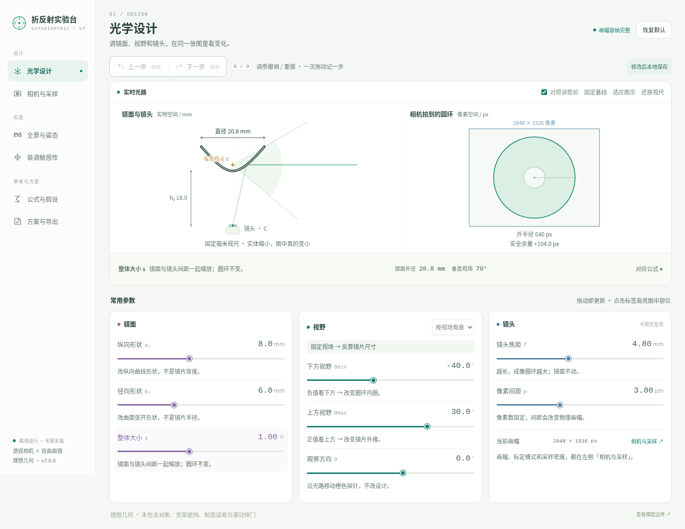

# Catadioptric Lab · 折反射实验台

**看着光路调整参数，理解双曲面镜、镜头和传感器如何一起决定全景成像。**

用于学习中心式折反射相机、比较理想几何候选方案，以及检查视场、成像圆环与像素采样。无需指定相机型号，无需账号、后端或运行时依赖。

**当前包：v7.0.0（2026-09-15）。这是本地更新包，未代你提交或发布网站。**

[在线工具入口](https://shiuhou.github.io/catadioptric-lab/) · [直接打开本包的 index.html](index.html) · [变更记录](CHANGELOG.md) · [测试与复现](docs/TESTING.md)

> 在线入口可能仍运行旧版本。上传并部署后才会成为本包版本；以页面左下角或 HTML 的 app-version 为准。



## 一分钟上手

直接用桌面浏览器打开 `index.html`，不需要运行 npm 或 Python。首次打开使用通用示例；更换硬件前，先理解三个小实验：

1. **缩放实物：**在「光学设计」把整体大小 `s` 从 1 调为 0.5。固定显示比例时，镜面会变小；理想成像圆环不变。
2. **改变成像：**点「上一步」恢复，再将焦距 `f` 从 4.8 改为 7.2 mm。圆环放大，镜面形状不变，可能触及画幅边界。
3. **改变覆盖：**先恢复焦距，再调上方视场。看镜片外径和圆环外缘联动；点击图下「对应公式」，在原页看数值代入。

以上是模型内实验，不是实物性能承诺。灰色轮廓表示修改前或固定的比较基线；「适应图示」改变显示比例，不改变设计参数。

## 六个页面

| 页面 | 输入 / 操作 | 得到什么 |
|---|---|---|
| 光学设计 | 镜面形状、尺寸、视场、镜头 | 实时反射光路、圆环、画幅余量 |
| 相机与采样 | 粘贴规格、确认四个数值、或输入标定 fpx | 传感器画幅、像素投影、方向采样密度 |
| 全景与姿态 | 航向、倾斜、输出宽度、校正开关 | 合成圆环与展开图；棋盘格标示未拍到的方向 |
| 装调敏感性 | 横向 / 轴向移动投影中心 | 二维反射方向误差与延长线偏离 |
| 公式与假设 | 查看 14 组公式和实时计算 | 符号、单位、推导关系及来源 |
| 方案与导出 | 基线对照、本地恢复设置、导入导出 | JSON、CSV、XYZ 与完整参数表 |

「上一步 / 下一步」是撤销 / 重做，不是页面翻页；一次完整滑块拖动或一次应用规格只记一步。最多保留最近 100 步，撤销历史不跨会话保存。数字 / 文本输入框内保留浏览器自身的文字撤销；离开后可用 Ctrl/⌘ Z、Ctrl/⌘ Shift Z 操作设计历史。

## 相机规格：先核对，再应用

参与几何计算的四项为图像宽度 Nx、高度 Ny、像素间距 p（μm）、实际镜头焦距 f（mm）。也可在下方使用对应输出分辨率的标定像素焦距 fpx。

解析器是确定性文字规则，不是 AI、OCR 或商品资料查询。支持中文 / English 标签及 Tab / `|` 分列的对比表。

- `Focal length: 2.8–12mm`：不会填入 2.8；需手动填入本次实际值。
- `Resolution: 2688x1520, 1920x1080`：列出候选，不自动选择第一项。
- 缺单位、空值、重复冲突、等效焦距：不能直接当作确定的实际参数。
- 核对区区分「原文提取」「手动确认」「已选择采集模式」「待确认」。

内置 GC4653 / OS04A10 示例**只按原用户规格截图转录，未重新核实厂商数据**。镜头焦距、光圈和 FOV 只代表该表配套模组，不能推广为所有同型号传感器的配置。光学格式、帧率、快门、动态范围、曝光、畸变百分比与原镜头 FOV 只记录，不参与新光学模型、不转换为缺失的标定参数。

## 保存、恢复与分享

完成一次有效修改后，工具尝试在当前浏览器本地保存**数值设计、基线及视图状态**。重新打开时会询问是否恢复。无效参数不会覆盖最后的有效记录。

默认不保存相机型号、规格原文、来源记录或尚未应用的文本。需要时，在「方案与导出 → 本地恢复与隐私」明确勾选保存已应用来源。取消勾选会移除持久记录中的来源数据。清除记录不改变当前设计；下次完成修改才会再保存。

**浏览器可能禁止或清理本地存储，直接 `file:` 打开、换文件位置、浏览器或设备也不保证继承。重要设计必须导出 JSON。** 状态栏会在本地保存失败时明确提醒；不会因此让计算功能停用。

| 导出 | 内容与边界 |
|---|---|
| JSON | 完整数值参数、已应用的相机来源、结果和假设；兼容旧 `catadioptric-lab-v1` schema |
| CSV | 361 个俯仰样本的镜面位置、图像半径与方向采样 |
| XYZ | 401 个毫米坐标的半截面样本，供 CAD 曲线输入；不是制造图纸 |

**JSON 导出仍包含已应用的相机来源文字，发送前请检查隐私。** 本地保存的隐私勾选只控制浏览器存储，不控制主动导出的文件。

分享网页地址仅分享工具，不分享当前调参状态；本版仍用 JSON 导入 / 导出交换具体方案，尚未添加参数链接或云同步。

## 模型边界

采用理想针孔相机、旋转双曲面镜、方形像素及居中主点。焦点与镜面的关系遵循页面定义的坐标约定。对正常参数范围，v7 保留此前的几何公式，仅补强软件计算域、错误反馈和结果有效性检查。

**未建模：**有限孔径、调焦和景深、镜头畸变、主点偏移、支架 / 机体遮挡、镀膜与表面质量、滚动快门、真实图像噪声及制造误差。装调实验仅采样二维轴截面，不是三维全局最坏情况；全景图是合成方向纹理，不是拍摄样片。

软件输入范围用于阻止不稳定或无意义计算，**不是硬件推荐范围或可制造性保证**。即使数值测试通过，也不代表实物对焦、标定、制造或飞行安全经过验证。

[坐标、公式与计算域](docs/MODEL.md)

## 本地修改与验证

使用者只需 `index.html`；开发者改 `src/`，再生成相同的离线单 HTML：

```sh
npm run build
npm test
npm run check
```

构建和数值测试只使用 Node.js 内置模块，无需 `npm install`。本包使用 Node.js 22.16.0 验证。浏览器测试的额外依赖及当前验证范围见 [docs/TESTING.md](docs/TESTING.md)。

```text
index.html                已构建的离线网页 / 网站入口
src/                      镜面计算、规格解析、UI、CSS 和页面模板
scripts/                  无第三方依赖的构建与测试入口
tests/                    数值、解析、回归和浏览器检查
assets/                   README 截图与分享预览图
examples/                 规格输入与旧格式参数示例
docs/                     模型、验证和本地更新说明
evidence/                 本次测试日志和截图
DEPLOYMENT.md             本地替换和 Pages 发布说明
CHANGELOG.md              本版修复、新增与保留的限制
```

本包未代持有人新增或选择开源许可证；查看 [LICENSE_STATUS.md](LICENSE_STATUS.md)。
